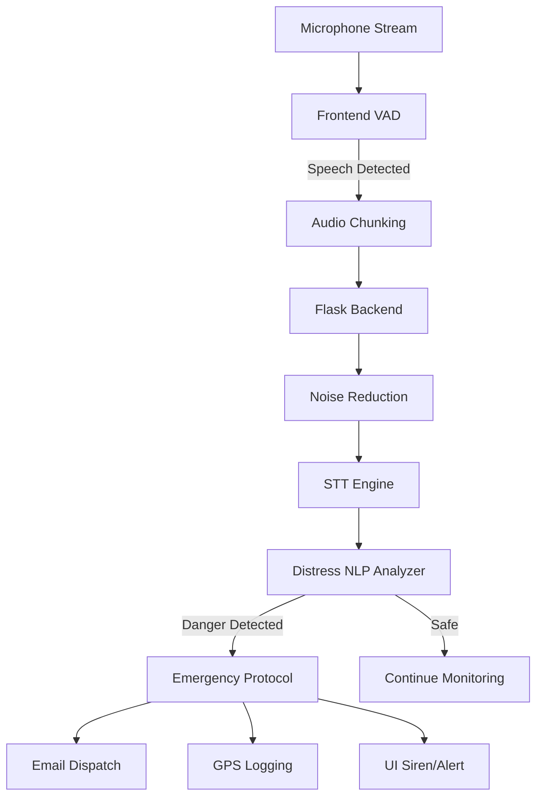

# 🛡️ AI Voice Guardian: Women's Safety Voice Assistant

[](https://www.python.org/)
[](https://flask.palletsprojects.com/)
[](https://opensource.org/licenses/MIT)

> **Winner/Submission for Hackathon 2026**
> An advanced, AI-powered real-time voice monitoring system designed to provide 24/7 proactive safety for women through automated distress detection and emergency response.

---

## 🌟 Vision
In critical situations, every second counts. Traditional safety apps require manual intervention (touching the phone), which isn't always possible during an attack. **AI Voice Guardian** solves this by using **passive, continuous voice monitoring** to detect distress signals and trigger immediate help without a single touch.

---

## 🚀 Key Features

### 1. 🎤 Hands-Free Continuous Monitoring
*   **Always-On VAD:** Uses Voice Activity Detection (VAD) to passively monitor the environment.
*   **Non-Stop Pipeline:** Automatically chunks and processes audio every 4.5 seconds.
*   **Zero-Interaction Trigger:** Detects keywords even if the phone is in a pocket or bag.

### 2. 🧠 Intelligent Distress Analytics
*   **NLP Driven Detection:** Analyzes speech for distress keywords (e.g., "Help", "Someone is following me", "Danger").
*   **Danger Scoring:** Calculates a real-time "Danger Score" (0-100) based on intent and repeated triggers.
*   **Context Awareness:** Differentiates between casual conversation and emergency situations.

### 3. 🚨 Instant Emergency Response
*   **Automated Email Alerts:** Dispatches emergency emails with location links to trusted contacts.
*   **Real-time GPS Tracking:** Captures and stores precise location coordinates during incidents.
*   **Visual & Audio Siren:** Triggers high-decibel alert sounds and on-screen distress warnings.

### 4. 📊 Safety Dashboard
*   **Live Transcription:** View real-time output of processed speech.
*   **Incident Logging:** Securely logs all alerts and location history for later evidence.
*   **Analytics Hub:** Visual statistics on interactions and safety status.

---

## 🛠️ Technology Stack

| Component | Technology |
| :--- | :--- |
| **Backend** | Python, Flask |
| **Logic** | SpeechRecognition, Numpy, Pydub |
| **Database** | SQLite3 (Persistent storage for alerts & logs) |
| **Frontend** | HTML5, Modern CSS (Glassmorphism), Vanilla JavaScript |
| **Mapping** | Leaflet.js (OpenStreetMap) |
| **Audio** | FFmpeg (Native processing), Web Audio API |

---

## 🔌 System Architecture



---

## ⚙️ Installation & Setup

### 1. Prerequisites
*   Python 3.10+
*   FFmpeg (included in `ffmpeg_bin/` for Windows)

### 2. Clone the Repository
```bash
git clone https://github.com/Manoj-0806/AI_Voice_Guardian.git
cd AI_Voice_Guardian
```

### 3. Install Dependencies
```bash
pip install -r requirements.txt
```

### 4. Environment Variables
To enable actual email alerts, set your credentials:
```bash
setx ALERT_EMAIL_USER "your-email@gmail.com"
setx ALERT_EMAIL_PASS "your-app-password"
```

### 5. Run the Application
```bash
python app.py
```
Access the dashboard at: `http://127.0.0.1:5000`

---

## 📂 Project Structure
*   `app.py`: Flask application routes and audio pipeline orchestration.
*   `analyzer.py`/`distress_detection.py`: Core NLP logic for বিপদ (danger) scoring.
*   `emergency_alert.py`: SMTP-based notification system.
*   `database_manager.py`: SQLite interface for profile and analytics.
*   `static/js/main.js`: Frontend audio handling and Web Audio API logic.

---

## 🛡️ Future Roadmap
- [ ] **Mobile App Integration:** Native Flutter/React Native wrapper.
- [ ] **Hardware Trigger:** Integration with wearable panic buttons (BLE).
- [ ] **Offline Recognition:** On-device STT for low-connectivity areas.
- [ ] **Multi-Language Support:** Localizing distress keywords for regional safety.

---

## 👩‍💻 Developed By
**Manoj Kumar A**
*Hackathon Entry - 2026*

---

*“Security is not just a feature; it’s a fundamental right.”*
